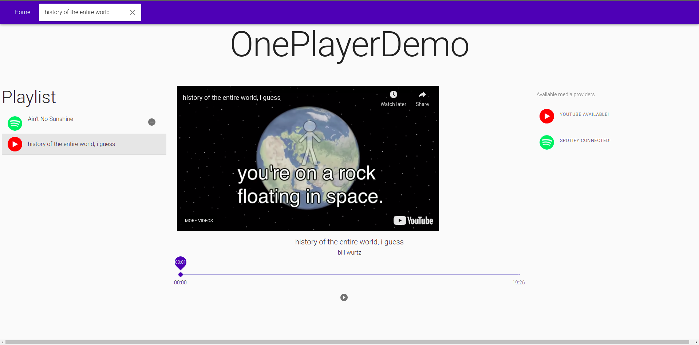

# oneplayer

OnePlayer is a demo music player app that lets you mix and match multiple media sources such as Spotify and YouTube in a single player.
NOTE: this is a very rudimentary prototype of a source agnostic media player library (libSAMP) which lets developers write their own custom connectors (ex. Soundcloud or local file playback) and control them together from a single API. For demo purposes, there's a small web-app built atop libSAMP showing YouTube and Spotify in a single player.



## Setting up

[Install npm](https://www.npmjs.com/get-npm)

Install typescript

```bash
npm install -g typescript
```

Now you can build libSAMP which is the backend pure-typescript library that abstracts out multiple media players into a single API.

### libSAMP

```bash
cd libsamp/
npm install
npm run build
cd ../
```

Optionally, if you want to use this local version of libSAMP for building the web-app in the next section, you will have to symlink it as:

```
cd libsamp/
npm link
cd ../web-app-ts
npm link libsamp
cd ../
```

### Web App

After you create an application on the [Spotify developers dashboard](https://developer.spotify.com/dashboard/applications) to get Spotify credentials and obtain a [YouTube API key](https://developers.google.com/youtube/registering_an_application), copy the `config_example.ts` file to `config.ts` and fill in the relevant bits.

To build the web-app, simply run the following after libSAMP is built:

```bash
cd web-app-ts/
npm install
npm start
```
